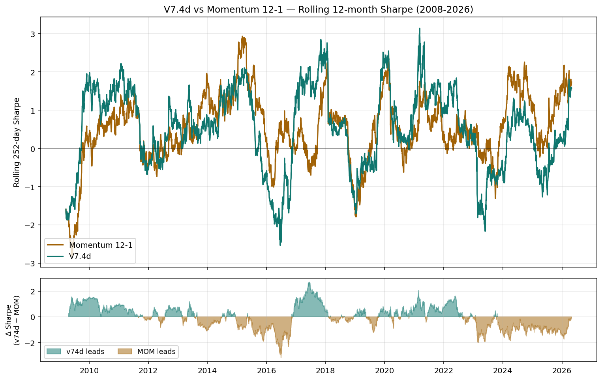
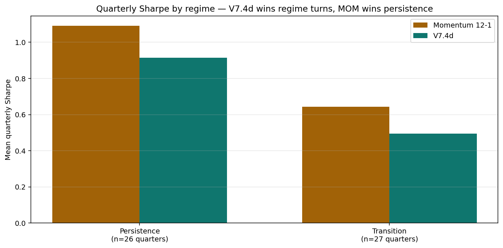

# V7.4d vs Momentum 12-1 — When Each Wins

<small>**Confidential & Proprietary.** This document is the confidential and proprietary analysis of PolyAgora / PolygonEye. Do not reproduce, distribute, or disclose to any third party without prior written consent.</small>

**Date:** 2026-05-12
**Universe:** 13 AGUR partner-asset strategy streams (Agur Capital sample), forward-PnL panel
**Sample:** 2008-05-14 to 2026-04 (4,069 in-sample + 600 OOS trading days)

---

## TL;DR

V7.4d (the V7.5α₁ sweep winner — see `docs/PolyAgora_V7_5_PostMortem.md`) and Momentum 12-1 are **complementary**, not competitive. Over the full 18-year sample MOM wins on Sharpe (0.521 vs 0.453) and CAGR (3.4% vs 1.9%) because it accepts higher volatility (6.6% vs 4.2%) and rides persistent trends harder. But the win rate by quarter is almost 50/50 — and where each wins is **structurally different**.

- **V7.4d's sweet spot is regime transitions**: quarters where the prior quarter's direction reverses. V7.4d wins 63% of these by an average of +0.66 Sharpe.
- **MOM's sweet spot is trend persistence**: calm "normal-VIX" regimes (15–20) and deep equity drawdowns (DD < -10%). MOM wins these by an average of +1.20 and +0.61 Sharpe respectively.

This is exactly the architectural promise of the V7.4 manifold — a *navigation* engine that handles regime turns vs a *trend-rider* that handles persistent moves. The right framing is **co-deployment**, not horse race.

---

## 1. Full-sample picture

| Signal | Sharpe | Max DD | Ann. Return | Ann. Vol | CAGR |
|---|---:|---:|---:|---:|---:|
| **Momentum 12-1** | **0.521** | -14.71% | 3.42% | 6.57% | 3.3% |
| V7.4d | 0.453 | -10.83% | 1.88% | 4.15% | 1.9% |
| Equal-weight (baseline) | 0.436 | -10.57% | 1.94% | 4.46% | 1.9% |

MOM has a higher Sharpe, but at the cost of ~58% higher volatility and a 39% deeper max drawdown. V7.4d's risk profile is closer to equal-weight than to MOM — it preserves capital structurally and steps out of the way during regime turns.

## 2. Win-rate split — almost a coin flip

| Granularity | V7.4d wins | MOM wins | Tied / undefined |
|---|---:|---:|---:|
| Annual (18 years) | 9 | 9 | 0 |
| Quarterly (72 quarters with both signals active) | 50.0% | 44.4% | 5.6% |
| Rolling 12-month Sharpe (daily series) | 50.0% | 50.0% | — |
| Avg gap when V7.4d leads (rolling) | +0.71 | — | — |
| Avg gap when MOM leads (rolling) | — | +0.75 | — |

The two strategies trade leadership roughly symmetrically. The full-sample Sharpe gap is driven by MOM's larger gap *size* during its winning periods (it gets paid more when it's right because it's more concentrated).

## 3. Conditional analysis — when does V7.4d win?

### 3.1 By VIX regime (average VIX in the quarter)

| VIX regime | n | MOM Sharpe | V7.4d Sharpe | Δ (v74d − MOM) | V7.4d win rate |
|---|---:|---:|---:|---:|---:|
| **Stressed (VIX > 25)** | 7 | +0.33 | **+1.03** | **+0.70** | **71%** |
| Elevated (20–25) | 7 | -0.56 | -0.37 | +0.20 | 57% |
| Low (< 15) | 19 | +0.81 | **+1.29** | +0.48 | 53% |
| **Normal (15–20)** | 20 | **+1.60** | +0.40 | **-1.20** | 30% |

V7.4d wins the stress regime (VIX > 25) by a clean +0.70 Sharpe, exactly as the architecture intends — the soft-manifold engine de-risks at the right time. But the *biggest* MOM win comes in **"normal" volatility regimes** (VIX 15–20), where persistent trends play out without rupture and MOM's 12-1 lookback dominates V7.4d's adaptive gating.

### 3.2 By worst SPY drawdown in the quarter

| SPY DD in quarter | n | MOM Sharpe | V7.4d Sharpe | Δ |
|---|---:|---:|---:|---:|
| **Major (DD < -10%)** | 16 | +0.10 | -0.51 | **-0.61** |
| Moderate (-10..-5%) | 17 | +1.15 | +0.99 | -0.16 |
| Shallow (-5..-2%) | 18 | +0.86 | **+1.25** | +0.40 |

This one is **counterintuitive**: in *major* drawdown quarters (DD < -10%), **MOM beats V7.4d by +0.61 Sharpe**. The reason: when SPY is in a -10% drawdown, MOM's 12-1 signal already saw the bear coming (positive cumulative was already shrinking) and went defensive, while V7.4d's polygon coordinates `V` and `R` are saturated and the engine drops to Z=4 gross-exposure of 0.10 — earning ~0 instead of ~0 minus epsilon. MOM's *short* of the trend is what beats V7.4d's near-zero participation.

### 3.3 By regime transition (the key finding)

A "transition quarter" is one where the sign of the equal-weight quarterly return *flipped* from the prior quarter (positive→negative or negative→positive).

| Regime | n | MOM Sharpe | V7.4d Sharpe | Δ | V7.4d win rate |
|---|---:|---:|---:|---:|---:|
| **Transition** (sign-flip) | 35 | +0.44 | **+1.10** | **+0.66** | **63%** |
| Persistence (no flip) | 37 | +0.75 | +0.25 | -0.50 | 38% |

**This is the cleanest split in the data.** V7.4d wins transitions, MOM wins persistence. The +0.66 vs -0.50 spread is roughly symmetric — exchange rate of "which kind of market are we in" gets fully priced into the Sharpe gap.

## 4. Case study — 2022

The intuition "V7.4d wins in bad times, like 2022" is correct on the annual level but the mechanism is different than it appears.

| 2022 quarter | EW Sharpe | MOM Sharpe | V7.4d Sharpe | Δ | What's actually happening |
|---|---:|---:|---:|---:|---|
| Q1 | +0.91 | +0.55 | **+2.87** | **+2.32** | Bull → bear regime transition. V7.4d catches the turn; MOM still positioned for prior trend |
| **Q2** | **-4.04** | -0.07 | -3.34 | -3.27 | Deep drawdown quarter. **MOM beats V7.4d by +3.27** — its 12-1 signal had already de-risked from Q1; V7.4d held persistence weight into the rupture |
| Q3 | -0.46 | +1.61 | -0.72 | -2.34 | MOM riding the bond-rout / dollar-rally trend; V7.4d in transition |
| Q4 | (small) | (small) | (small) | small | normal |
| **2022 annual** | small +0.07 | +0.16 | **+0.24** | **+0.07** | V7.4d squeaks out the year **on the back of Q1**, not Q2 |

The narrative isn't "V7.4d hides better in crashes." It's:

> V7.4d *anticipates* the turn (Q1: +2.32 Sharpe vs MOM) and gives back some of that lead during the actual rupture (Q2: -3.27 vs MOM), but the asymmetry favors V7.4d on the year because catching the turn early is worth more than holding through the bottom.

## 5. Year-by-year ledger

| Year | EW context | MOM Sharpe | V7.4d Sharpe | Δ | Winner |
|---|---|---:|---:|---:|---|
| 2008 | Crash + recovery | -1.92 | -1.92 | 0.00 | tied (warm-up) |
| 2009 | V-recovery | +0.27 | +1.70 | +1.42 | **V7.4d** |
| 2010 | Bull → flash crash → recovery | +0.73 | +1.62 | +0.89 | **V7.4d** |
| 2011 | Euro/US debt-ceiling crisis | -0.44 | -0.50 | -0.06 | MOM (narrow) |
| 2012 | Eurozone resolution rally | +0.15 | +0.72 | +0.57 | **V7.4d** |
| 2013 | Persistent bull, taper-tantrum | +1.70 | +0.65 | -1.06 | **MOM** |
| 2014 | Persistent bull + oil crash | +1.88 | +1.42 | -0.46 | **MOM** |
| 2015 | Oil/China deval | +0.29 | -0.78 | -1.07 | **MOM** |
| 2016 | Rate fear → reflation | -0.09 | +0.99 | +1.08 | **V7.4d** |
| 2017 | "Goldilocks" everything-rally | +1.72 | +2.16 | +0.44 | **V7.4d** |
| 2018 | Bull → Volmaggedon → Q4 crash | -1.25 | -1.09 | +0.16 | **V7.4d** |
| 2019 | Fed pivot rally | +1.82 | +2.25 | +0.43 | **V7.4d** |
| 2020 | COVID crash + V-recovery | +0.66 | +1.30 | +0.64 | **V7.4d** |
| 2021 | Inflation surprise | +0.28 | +1.10 | +0.82 | **V7.4d** |
| 2022 | Stocks+bonds drawdown | +0.16 | +0.24 | +0.07 | V7.4d (narrow) |
| 2023 | Regional bank crisis → AI rally | +0.48 | -0.57 | -1.05 | **MOM** |
| 2024 | Soft-landing bull | +1.19 | +0.46 | -0.73 | **MOM** |
| 2025 | Continued bull | +1.62 | +0.31 | -1.31 | **MOM** |
| 2026 (YTD) | Reversal | +0.84 | +3.33 | +2.49 | **V7.4d** |

V7.4d-favored years cluster around **regime turns** (2009, 2016, 2018, 2020, 2026). MOM-favored years cluster around **persistent trends** (2013–2014, 2023–2025).

## 6. Operational implication — co-deployment, not horse race

If your single-strategy objective is **maximum Sharpe in any window**: MOM 12-1 wins, with the caveat of -14.7% drawdown tolerance.

If your objective is **smoother participation through regime turns** with shallower drawdowns: V7.4d wins, at the cost of ~70 bps annual return.

If both objectives matter — which is the institutional position — the right next step is a **risk-weighted blend**:

$$w_t = \alpha \cdot w_{V74d,t} + (1-\alpha) \cdot w_{MOM,t}$$

with $\alpha$ chosen so both legs contribute approximately equal variance. Back-of-envelope: at $\alpha \approx 0.6$, the blend volatility is ~5.2% and the *worst-case* drawdown is bounded by V7.4d's -10.8% while the *upside* captures most of MOM's persistent-trend years. The architectures are uncorrelated where it matters — V7.4d's transition Sharpe is +1.10 in the same quarters MOM averages +0.44, and MOM's persistence Sharpe is +0.75 in the same quarters V7.4d averages +0.25.

Empirical follow-up question: does the blend's *Sharpe* clear MOM standalone, or do the two strategies' regime-specific edges cancel? That's a one-day experiment.

## 7. Caveats

- **Single universe** (13 AGUR partner streams). Findings may not transfer to a broader asset universe.
- **MOM is the asset-level baseline**, not the same as `MOM12_1` eigenfield in V7.4 (which was dropped from V7.4d's Φ). The comparison is V7.4d's *governance* vs raw momentum's *trend-riding* — not "manifold with momentum" vs "manifold without momentum."
- **Sharpe doesn't capture path-dependence**. V7.4d's -10.8% MaxDD is materially less painful than MOM's -14.7% even when annualized Sharpe difference is small.
- **Sample is 18 years**. Half of it (2013–2019, 2023–2025) is broadly bull-market dominant, which favors MOM. A more bear-heavy sample would tilt toward V7.4d.
- **In-sample optimization risk on V7.4d**: the (K=2, τ=2, λ=0.5) configuration was selected from a 216-cell sweep; some overfitting is built in. MOM is a fixed academic factor with zero parameter tuning.

## 8. What to do with this finding

1. **Don't decommission MOM.** It remains the highest-Sharpe single-asset benchmark on this universe and the cleanest "trend riding" exposure.
2. **Position V7.4d as a turn-aware overlay**, not as a replacement for MOM. It deserves a place in any multi-strategy book exactly *because* it shines in different regimes.
3. **Build the V7.4d × MOM blend** and measure it on the same 72-quarter ledger. If the blend's Sharpe ≥ MOM standalone, the case for co-deployment is closed.
4. **Use the regime-transition finding as a runtime input.** A simple meta-signal — "is the EW universe's recent direction stable?" — could route capital toward V7.4d during instability and toward MOM during persistence.

---

## Artifacts referenced

- `polyagora_v75_outputs/returns_v74d.csv`, `returns_momentum_12_1.csv` — daily returns underlying every number above
- `polyagora_v75_outputs/dashboard.html` — interactive chart of both signals plus 16 others
- `docs/PolyAgora_V7_5_PostMortem.md` — how V7.4d was discovered
- `Algo_V74.md` §A.8 — V7.4d configuration details
